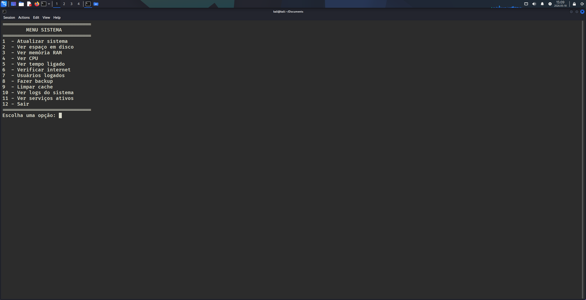
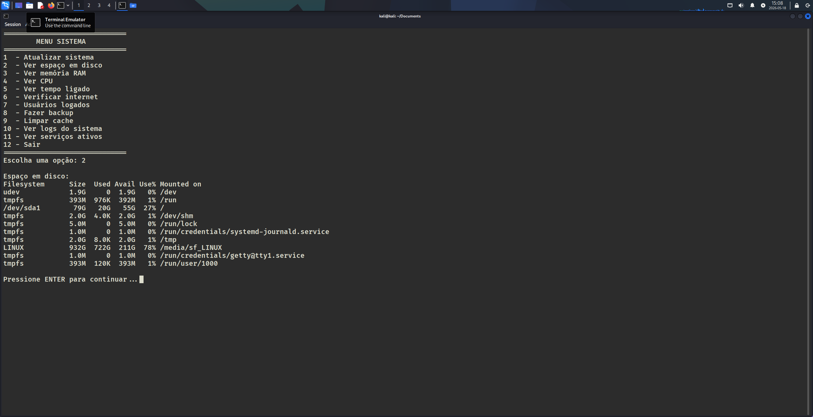
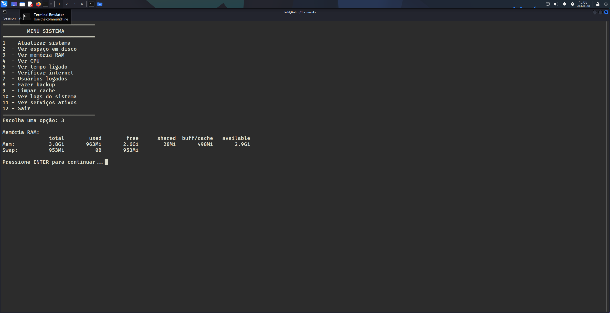
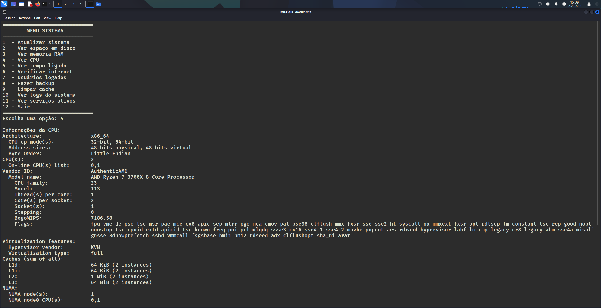

# 📊 Linux System Monitor Script


Um script em Bash simples, interativo e direto ao ponto para automação de tarefas e monitoramento de rotinas essenciais em sistemas Linux.

---

## 📝 Sobre o Projeto

Este projeto nasceu com o propósito prático de consolidar conhecimentos em **administração de sistemas Linux**, **lógica de programação** e **automação utilizando Shell Script**. 

Através de uma interface textual (CLI) limpa e intuitiva, o usuário consegue extrair dados vitais do sistema e executar comandos administrativos sem a necessidade de lembrar de sintaxes complexas.

---

## 🚀 Funcionalidades

O script oferece um menu interativo com 12 opções estruturadas para o gerenciamento diário:

* **⚡ Atualização do Sistema:** Automatiza o processo de update e upgrade dos pacotes.
* **💾 Espaço em Disco:** Exibe o uso de armazenamento das partições montadas.
* **🧠 Memória RAM:** Mostra o consumo atual de RAM e Swap em tempo real.
* **💻 Informações da CPU:** Detalha a arquitetura, modelo e núcleos do processador.
* **⏱️ Tempo de Atividade (Uptime):** Informa há quanto tempo o sistema está ligado.
* **🌐 Teste de Conectividade:** Verifica o status da conexão com a internet através de ping.
* **👤 Usuários Logados:** Lista quais usuários estão com sessões ativas na máquina.
* **📦 Backup Automatizado:** Cria uma cópia compactada simples do diretório `HOME`.
* **🧹 Limpeza de Cache:** Libera espaço limpando memórias temporárias desnecessárias.
* **📁 Logs do Sistema:** Facilita o acesso rápido aos registros de eventos essenciais.
* **⚙️ Serviços Ativos:** Lista os processos e serviços em execução no momento.
* **❌ Sair:** Encerra a execução do menu com segurança.

---

## 📸 Demonstração

Veja o script em ação dentro de um ambiente controlado (Kali Linux):

### Menu Principal
A interface inicial centraliza todas as ferramentas disponíveis para o usuário:


### 1. Verificação de Espaço em Disco (Opção 2)
Retorno detalhado sobre o uso das partições do sistema:


### 2. Monitoramento de Memória RAM (Opção 3)
Visualização clara do consumo de memória física e virtual:


### 3. Informações de CPU (Opção 4)
Diagnóstico completo do hardware de processamento:


---

## 🛠️ Como Executar o Script

Para testar e utilizar o monitor em sua máquina local, siga os passos abaixo no terminal:

1. **Clone o repositório:**
   ```bash
   git clone [https://github.com/SEU-USUARIO/Monitoramento-Linux.git](https://github.com/SEU-USUARIO/Monitoramento-Linux.git)
   Acesse a pasta do projeto:
   
    Bash

    cd Monitoramento-Linux

    Conceda permissão de execução ao arquivo:
   
    Bash

    chmod +x Monitoramento.sh

    Execute o monitor:
   
    Bash

    ./Monitoramento.sh

    ⚠️ Nota: Algumas opções do menu (como atualização do sistema e limpeza de cache) exigem privilégios administrativos. Caso necessário, execute o script utilizando sudo ./Monitoramento.sh.

🎯 Objetivos de Aprendizado

O desenvolvimento deste script permitiu colocar em prática:

- Criação de loops e estruturas condicionais avançadas (while, case, if/else).
-  Manipulação de comandos nativos do ecossistema Linux (df, free, lscpu, tar, entre outros).
-  Formatação de saídas de texto no terminal para melhor experiência do usuário.
-  Boas práticas de versionamento de código com Git e GitHub.
    
👤 Autor

Fernando T. Dalcin.

